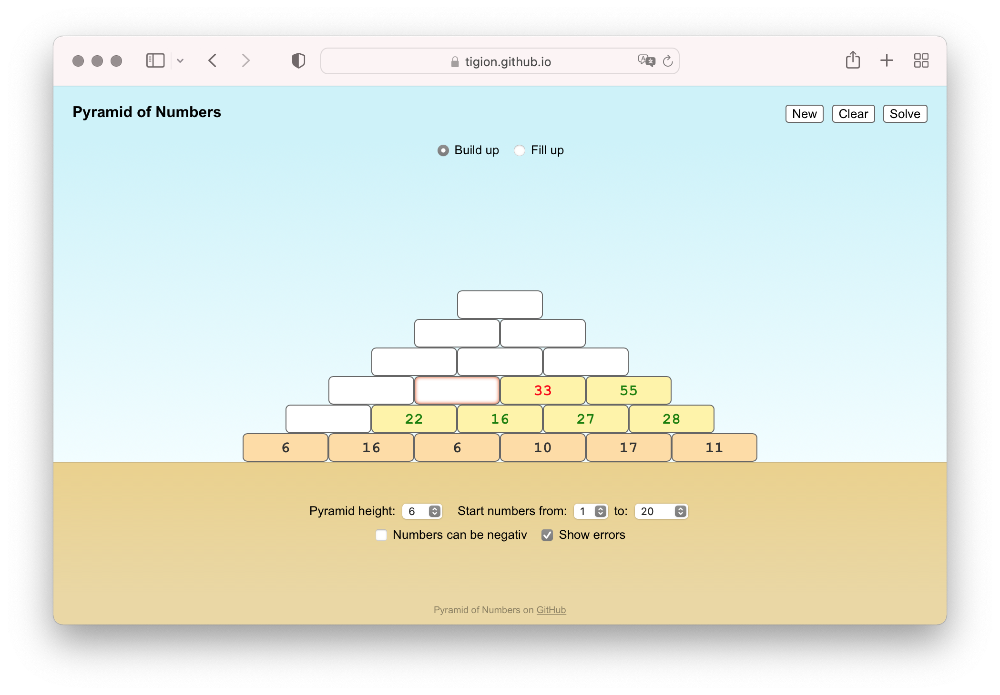

# Pyramid of Numbers

A pyramid of numbers as a web application for practicing arithmetic with plus and minus.

* Try it as GitHub Page: https://tigion.github.io/webapp-pyramid-of-numbers/

## Features

Work in progress ...

## Settings

Work in progress ...